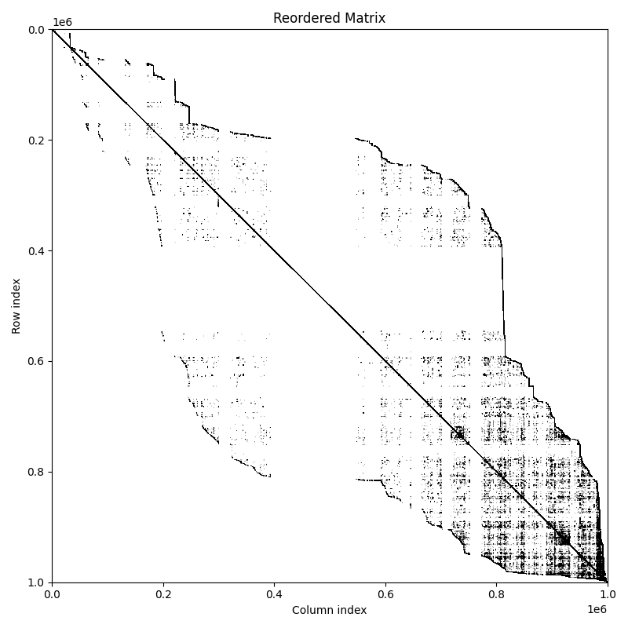
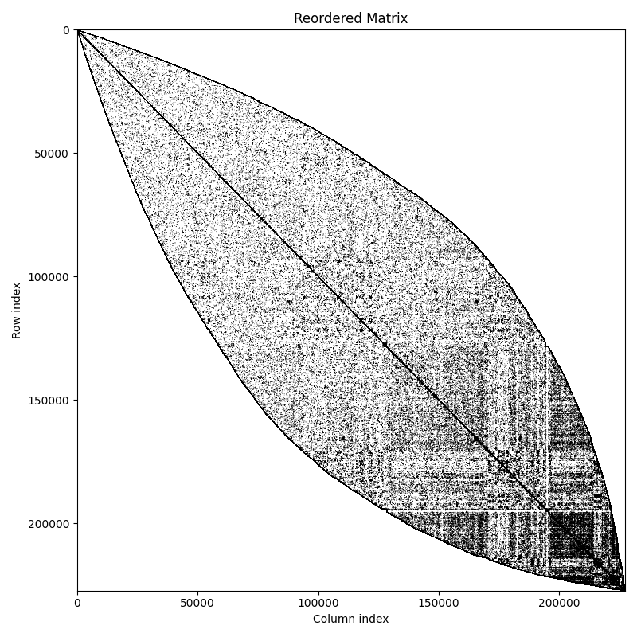
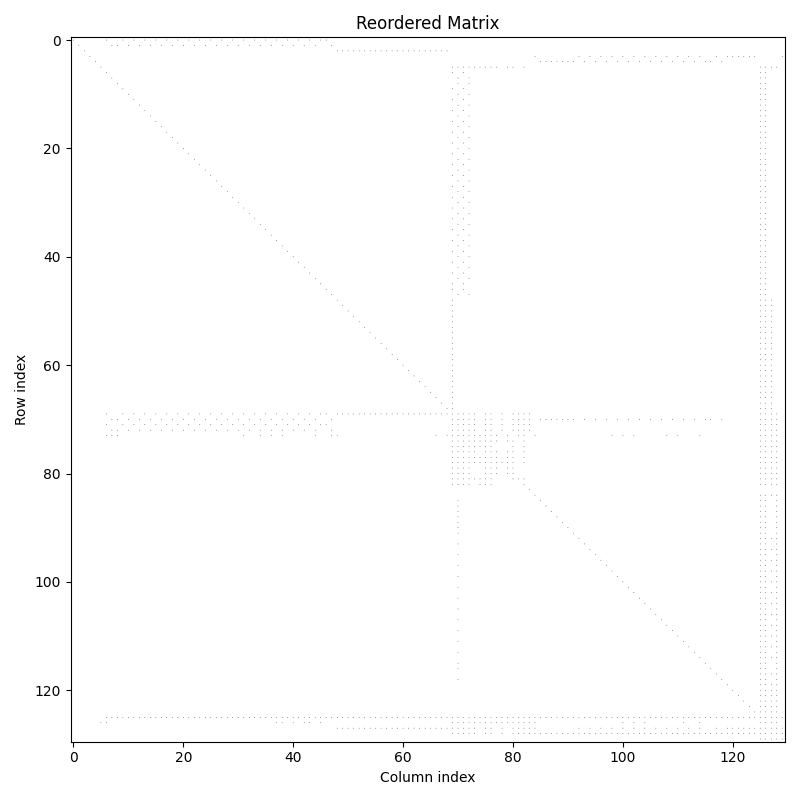

# QTreeInpla

QuadTree linear algebra implementation in Inpla.

# How to preprocess graphs

Structured matrices should better fit to quad-trees. 

You can use `./scripts/simple_mtx_reordering.py` to reorder matrices stored in `mtx` files.

```bash
python reorder_mtx.py input.mtx output.mtx --method rcm
```

For visual control of reordering you can use `./scripts/draw_mtx_sparsity.py`

```bash
python spy_mtx.py original.mtx original_spy.png --title "Original Matrix"
```

## Examples of reordering

| Original | Reordered |
| :--- | :--- |
| webbase-1M.mtx |
|  |  |
| coAuthorsCiteseer.mtx |
|  |  |
| arc130.mtx |
|  |  |

# How to run experiments

* Make threaded patched Inpla from `experiments` branch:
```sh
git clone https://github.com/Lamagraph/inpla.git -b experiments

# Compile single-threaded version first (bug in vanilla Inpla):

make -C inpla && make -C inpla clean && make -C inpla thread
```

* Use `ulimit -s unlimited` for unlimited stack

* Run `./scripts/run_experiments.sh $PATH_TO_INPLA $MAX_THREADS` to run all experiments in `./experiments/` directory and collect the results OR run the experiments yourself: `./inpla/inpla -f ./experiments/bcspwr10.in -t 4 > ./experiments/my_4threaded_result.txt`

* After `./scripts/run_experiments.sh` you can `./scripts/results_to_data.fsx` to extract data on bfs time and conversion time ready to be plotted

* Download mtx matrices from SuiteSparse matrix collection and convert them to experiments using `./scripts/mtx_to_experiment.fsx $PATH_TO_MTX_MATRIX`

# How to run golden tests

Ensure dotnet is installed.

1. Clone patched Inpla repository at [Lamagraph/inpla](https://github.com/Lamagraph/inpla)
2. Compile to obtain Inpla executable
3. Make sure you are in the project directory (Inpla's `use` directives are relative to current working directory)
4. `dotnet fsi test.fsx -- $PATH_TO_INPLA_EXECUTABLE` or simply `./test.fsx $PATH_TO_INPLA_EXECUTABLE`

# LAGraph Benchmarks

To compare with LAGraph (GraphBLAS implementation), you need to compile the benchmark:

## Compile LAGraph benchmark

```bash
gcc -I/usr/local/include -I/usr/local/include/suitesparse lagraph_bfs.c -o lagraph_bfs \
    -L/usr/local/lib -llagraph -llagraphx -lgraphblas -lm -Wl,-rpath,/usr/local/lib
```

Note: Requires LAGraph and GraphBLAS installed in `/usr/local/`.

## Run LAGraph experiments

Download matrices from SuiteSparse and place them in `matrices/`:

* [cti](https://suitesparse-collection-website.herokuapp.com/MM/DIMACS10/cti.tar.gz)
* [bcspwr10](https://suitesparse-collection-website.herokuapp.com/MM/HB/bcspwr10.tar.gz)
* [G57](https://suitesparse-collection-website.herokuapp.com/MM/Gset/G57.tar.gz)
* [3elt_dual](https://suitesparse-collection-website.herokuapp.com/MM/AG-Monien/3elt_dual.tar.gz)

Run experiments:

```bash
./scripts/run_lagraph_experiments.sh <max_threads> <matrices_dir> <lagraph_bfs_path>

# Example:
./scripts/run_lagraph_experiments.sh 4 ./matrices ./lagraph_bfs
```

This creates results in `experiments/results_lagraph/<matrix_name>_lagraph/`.

## Process LAGraph results

```bash
dotnet fsi scripts/lagraph_results_to_data.fsx
```

Results are saved to:
- `experiments/data/bfs_data_lagraph/` - BFS times
- `experiments/data/convertation_data_lagraph/` - Matrix load times
