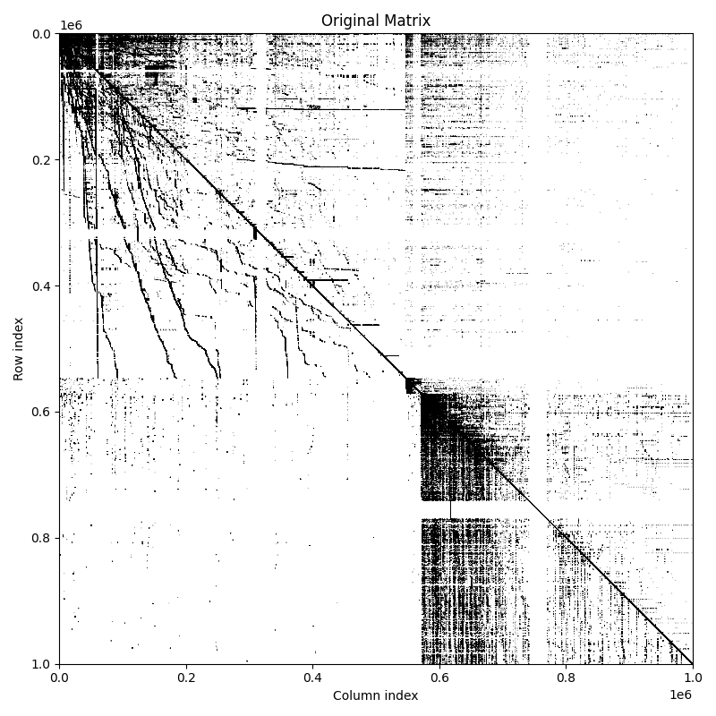
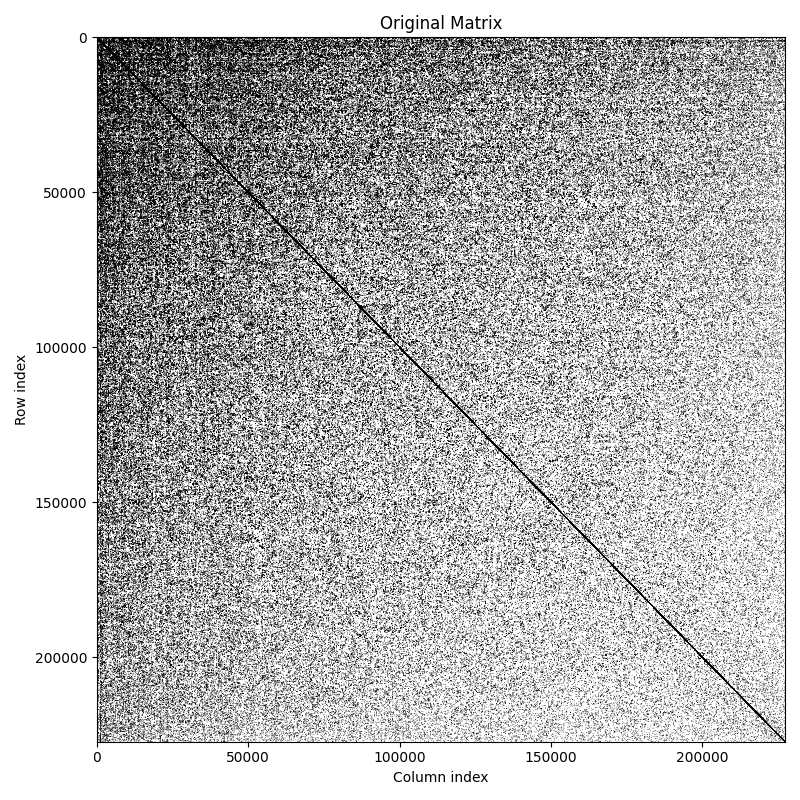
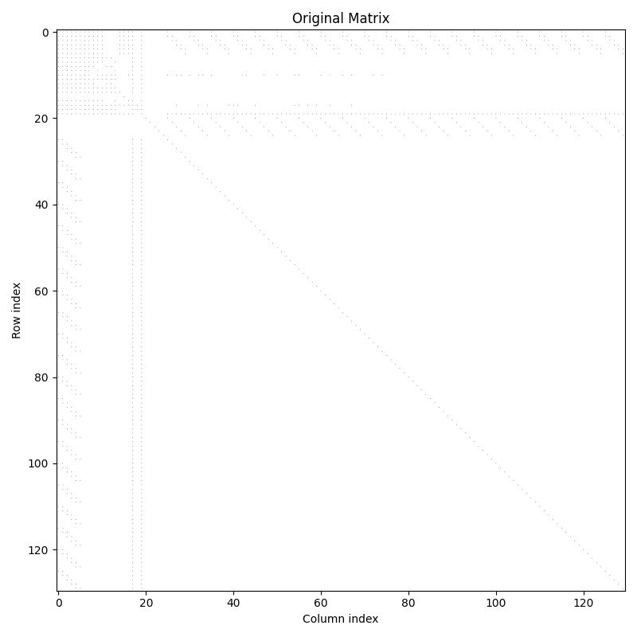

# QTreeInpla

QuadTree linear algebra implementation in Inpla.

# How to run experiments

* Make threaded patched Inpla from `experiments` branch:
```sh
git clone https://github.com/Lamagraph/inpla.git -b experiments

# Compile single-threaded version first (bug in vanilla Inpla):

make -C inpla && make -C inpla clean && make -C inpla thread
```

* Use `ulimit -s unlimited` for unlimited stack

* Run `./scripts/run_experiments.sh $PATH_TO_INPLA $MAX_THREADS $NUMBER_OF_RUNS $(bfs|tc|sssp)` to run all experiments in `./experiments_$(bfs|tc|sssp)/` directory and collect the results OR run the experiments yourself: `./inpla/inpla -f ./experiments_bfs/bcspwr10.in -t 4 -Xms 22 -Xmt 0 > ./my_4threaded_result.txt`

* Using all the memory necessary for running the experiment is preferred as it may increase performance. Use `-Xmt 0` to disable geometric memory consumption. Use `-Xms 22` or greater to use more memory from the start. Not doing that will drag down running speed significantly. Make sure not to overallocate. Do note that memory consumption is proportional to the number of threads used.

* After `./scripts/run_experiments.sh` you can `./scripts/results_to_data.fsx $(bfs|tc|sssp)` to extract data on algorithm time and conversion time ready to be plotted

* Download mtx matrices from SuiteSparse matrix collection and convert them to experiments using `./scripts/mtx_to_experiment.fsx $PATH_TO_MTX_MATRIX $(bfs|tc|sssp)`

# How to preprocess graphs

Structured matrices should better fit to quad-trees.

You can use `./scripts/simple_mtx_reordering.py` to reorder matrices stored in `mtx` files.

```bash
python reorder_mtx.py input.mtx output.mtx --method rcm
```

For visual control of reordering you can use `./scripts/draw_mtx_sparsity.py`

```bash
python spy_mtx.py original.mtx original_spy.png --title "Original Matrix"
```

## Examples of reordering

| Original | Reordered |
| :--- | :--- |
| webbase-1M.mtx |
|  |  |
| coAuthorsCiteseer.mtx |
|  |  |
| arc130.mtx |
|  |  |

# How to run golden tests

Ensure dotnet is installed.

1. Clone patched Inpla repository at [Lamagraph/inpla](https://github.com/Lamagraph/inpla)
2. Compile to obtain Inpla executable
3. Make sure you are in the project directory (Inpla's `use` directives are relative to current working directory)
4. `dotnet fsi test.fsx -- $PATH_TO_INPLA_EXECUTABLE` or simply `./test.fsx $PATH_TO_INPLA_EXECUTABLE`
